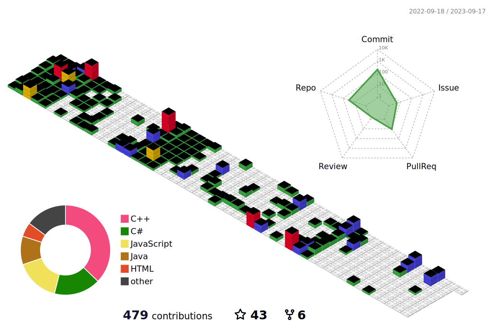

# Hello World, I am Muhammad Abdullah 👋

### I am a Software Engineer and Tech Enthusiast 
- 😄 I am currently striving to learn, develop & Grow.
- 🔭 I am currently working on Python, PHP and Laravel.
- 🌱 I am currently learning everything 🤣 but specifically expanding my knowledge in Full Stack Development.
- 👯 I am looking to collaborate on Web Development Projects.
- 🥅 2024 Goals: Contribute to open source and learn Full Stack Development as much as possible.
- 📢 I Love Programming, and learn new technologies.

	

## GitHub Analytics

	<a href="https://github.com/mabdullahgithub">
<!-- 		 -->
		
	</a>
	

## Contribution Graph

## Tech Stack

          

## Let's Connect
 

	
	
	
	 

     

